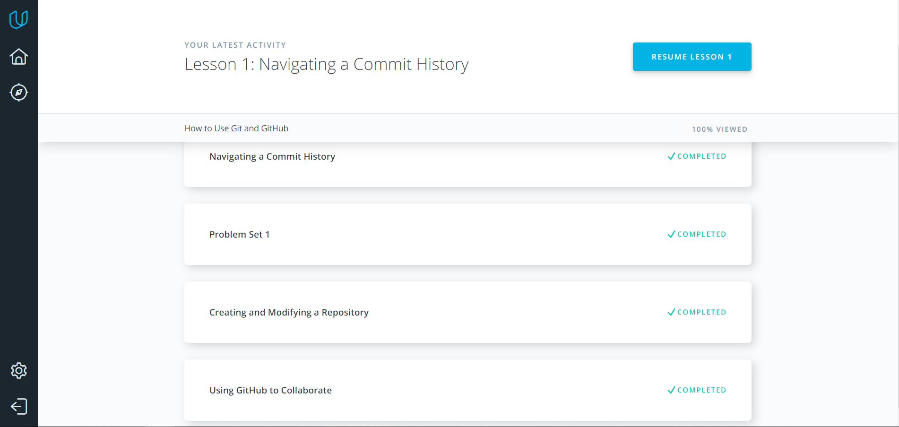
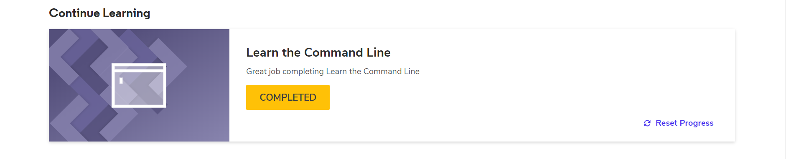
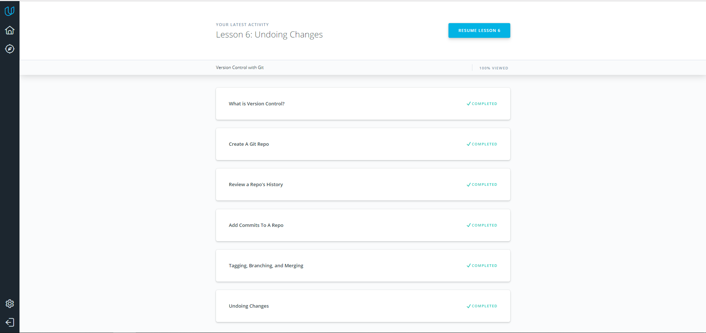
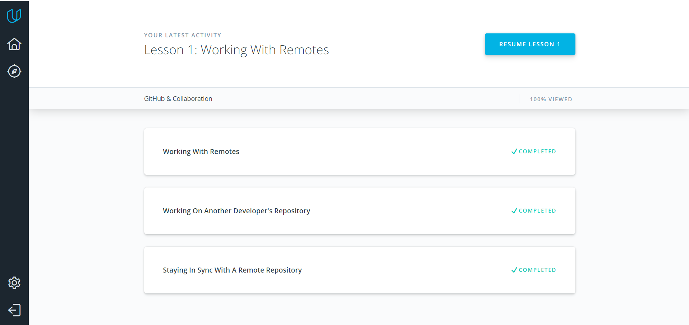
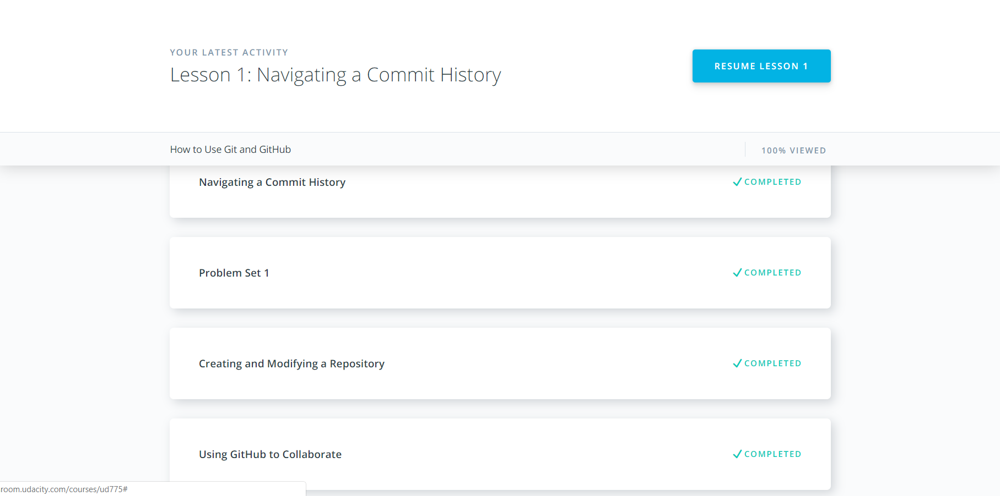

# kottans-frontend

## Git Basics

It was really awesome time, I get a lot of new information
about Git/Github and became more confident in this concepts:

 - `git log` 
 - `git diff --staged`
 - `git log --graph --oneline`
 -  fast-forward merge

## Linux CLI, and HTTP

In this lesson I repeated basic bash commands, and I known a lot information about environment variables: PATH, HOME, PS1 etc. Long and hard reading articles about HTTP was useful, they made me more confident in my knowledge in HTTP in general, and in: Cashing/Headers/Status-code/etc.

## Git Collaboration

In this lesson I repeated basic git basic. About new git commands, for me is new and really powerfull commands is:

 - `git commit --amend` 
 - `git shortlog --staged`
 - `git shortlog -s -n`
 -  combine git log and grep

## Intro to HTML and CSS

To be honest, nothing special in Udacity HTML/CSS course for me, 
but practice in the end of CSS course was really awesome. About HTML Academy, I guess it was better courses about markup in the whole world :)

