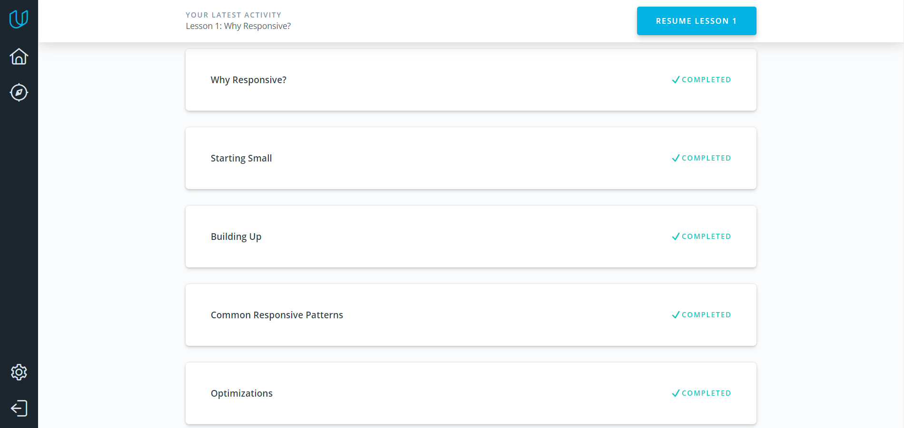
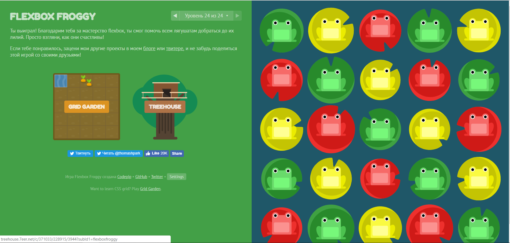
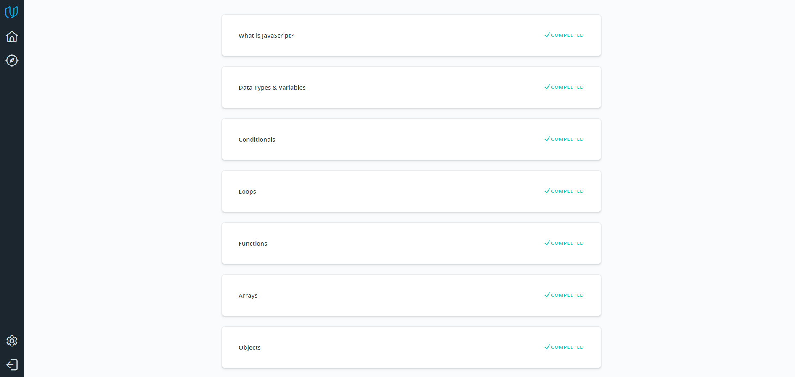
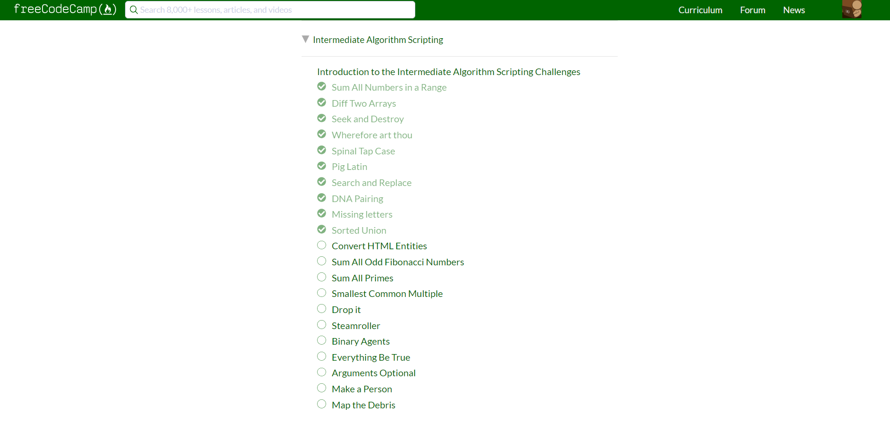
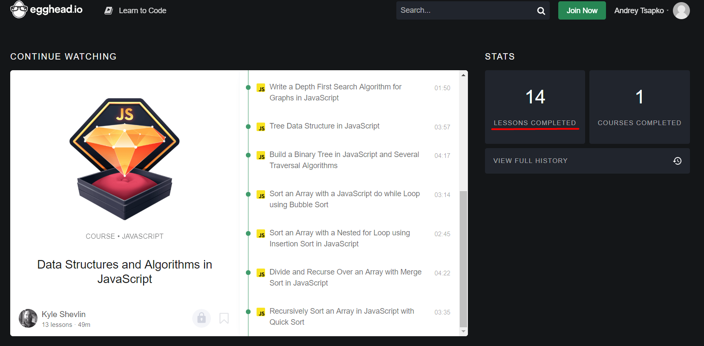
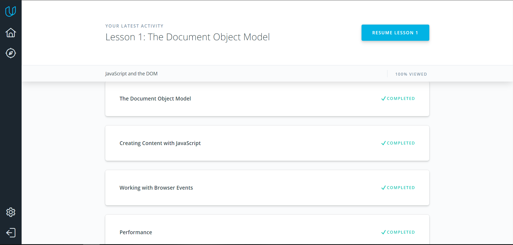
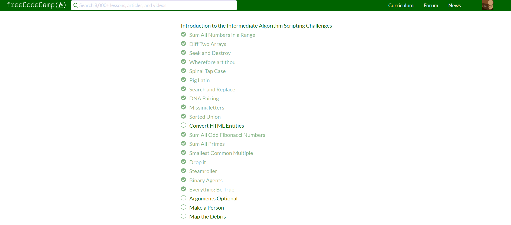

# kottans-frontend

- [Git Basics](#git_basics)
- [Linux CLI, and HTTP](#linux_cli)
- [Git Collaboration](#git_collab)

- [Intro to HTML and CSS](#intro_html)
- [Responsive Web Design](#web_design)
- [JavaScript Basics](#js_basics)
- [Document Object Model](#js_dom)

## <a name="git_basics">Git Basics</a>

It was really awesome time, I get a lot of new information
about Git/Github and became more confident in this concepts:

 - `git log` 
 - `git diff --staged`
 - `git log --graph --oneline`
 -  fast-forward merge

## <a name="linux_cli">Linux CLI, and HTTP</a>

In this lesson I repeated basic bash commands, and I known a lot information about environment variables: PATH, HOME, PS1 etc. Long and hard reading articles about HTTP was useful, they made me more confident in my knowledge in HTTP in general, and in: Cashing/Headers/Status-code/etc.

## <a name="git_collab">Git Collaboration</a>

In this lesson I repeated basic git basic. About new git commands, for me is new and really powerfull commands is:

 - `git commit --amend` 
 - `git shortlog`
 - `git shortlog -s -n`
 -  combine git log and grep

## <a name="intro_html">Intro to HTML and CSS</a>

To be honest, nothing special in Udacity HTML/CSS course for me, 
but practice in the end of CSS course was really awesome. About HTML Academy, I guess it was better courses about markup in the whole world :)

## <a name="web_design">Responsive Web Design</a>

Responsive table, srcset feature, and align-content is awesome, thx ^_^

## <a name="js_basics">JavaScript Basics</a>

In the first part of this course, I repeat basics concepts of javascript and data types, challenges after course is really great, I get stucked on 1 or 2, this case indicate gaps in my knowledge. Second part, God it was hard, but it's enjoyable pain, I used hint for 2 tasks. In third part I felt loneliness and complete missunderstending of the situation (speaker of this course like superhero flash, he spoke and wrote with double-quick speed and theme is really hard to understent :)

## <a name="js_dom">Document Object Model</a>

I felt more confident in algorithms, and knew several new features like document fragment, and insertAdjacentHTML, it's really cool and important features. Third task is really great, I choosed Gravity Falls theme, because, it's my sisters favourite cartoon :)

