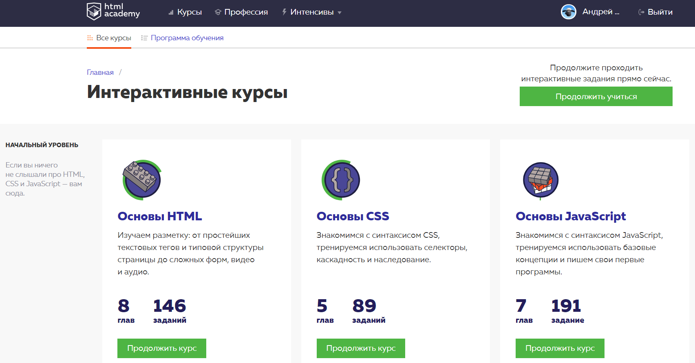

# kottans-frontend

## Task_0

It was really awesome time, I get a lot of new information
about Git/Github and became more confident in this concepts:

 - `git log` 
 - `git diff --staged`
 - `git log --graph --oneline`
 -  fast-forward merge

## Task_4

To be honest, nothing special in Udacity HTML/CSS course for me, 
but practice in the end of CSS course was really awesome. About HTML Academy, I guess it was better courses about markup in the whole world :)

